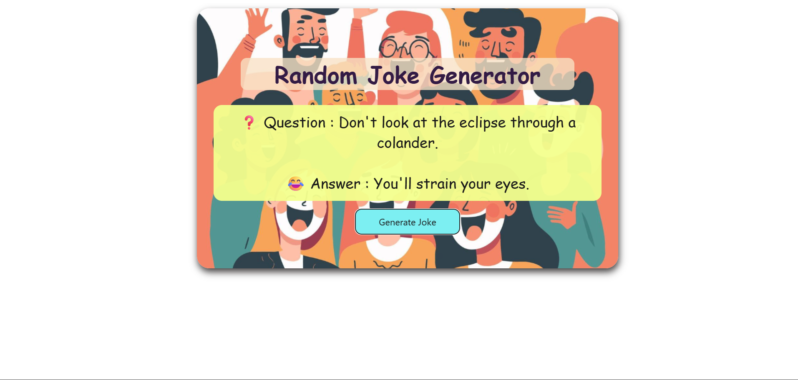

# Random Joke Generator

This project is a simple web application that generates random jokes using the [Official Joke API](https://official-joke-api.appspot.com/jokes/random). It demonstrates the use of HTML, CSS, and JavaScript (Fetch API) for creating an interactive and responsive application.

---

## Screenshot

---

## Features
- Fetches random jokes from an external API.
- Responsive design for different screen sizes.
- Simple and interactive user interface.

---

## Technologies Used
- HTML  
- CSS  
- JavaScript (Fetch API)

